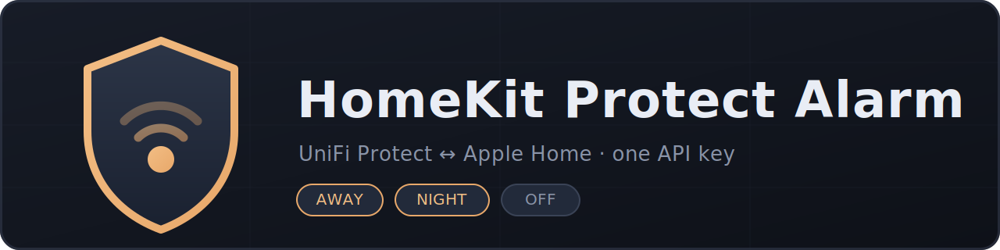

<p align="center">
  
</p>

<p align="center">
  <a href="https://www.npmjs.com/package/homebridge-protect-alarm"></a>
  <a href="https://www.npmjs.com/package/homebridge-protect-alarm"></a>
  <a href="LICENSE"></a>
  
  
</p>

# HomeKit Protect Alarm

Bring your **UniFi Protect alarm system** into Apple HomeKit as a native
Security System tile — arm and disarm from the Home app, Control Center,
automations, or Siri.

> "Hey Siri, set the security system to Away."

Authentication uses a **single UniFi OS API key**. No UniFi username or
password is stored in your Homebridge config, no session cookies, no CSRF
juggling — one key does everything.

## Features

- 🛡️ **Native HomeKit Security System** accessory — Away / Night / Off
- 🔑 **One API key** — generated in UniFi OS, pasted once
- 🔎 **Automatic arm-profile discovery** — profiles are matched by name, so you
  never hunt for internal IDs
- 🔁 **Two-way sync** — arming from a keyfob, the Protect app, or a UniFi
  automation is reflected back in HomeKit within seconds, including *which*
  mode (Away vs Night)
- ⏱️ **Countdown-aware** — an exit delay ("arming") is shown as armed so
  HomeKit doesn't snap back to Off mid-countdown
- 🪶 **Tiny** — one file, one dependency

## How HomeKit states map

| HomeKit | UniFi Protect action |
|---|---|
| **Away** | Activate your *Away* arm profile (exit delays respected) |
| **Night** | Activate your *Night* arm profile |
| **Home** | Disarm (Protect's alarm is one system, not zones) |
| **Off** | Disarm |

## Requirements

- A UniFi OS console running **UniFi Protect** with the alarm system set up
  (UDM, UDM Pro / SE, Cloud Key Gen2+, UNVR…)
- At least one **arm profile** configured in Protect (e.g. *Away*, *Night*)
- **Homebridge ≥ 1.6** on **Node ≥ 18**

## Installation

Search for **Protect Alarm** in the Homebridge UI plugin tab, or:

```bash
npm install -g homebridge-protect-alarm
```

## Setup

### 1. Generate an API key

1. Open your UniFi OS console in a browser
2. **Settings → Control Plane → Integrations**
3. **Create API Key**, give it a name like `homebridge`, and copy it —
   it is shown only once

### 2. Configure the plugin

Use the settings form in the Homebridge UI, or add this to `config.json`:

```json
{
  "platforms": [
    {
      "platform": "ProtectAlarm",
      "name": "Security System",
      "controller": "192.168.1.1",
      "apiKey": "PASTE_YOUR_KEY"
    }
  ]
}
```

That is the **entire** minimum configuration. On startup the plugin lists your
arm profiles and matches `Away` and `Night` by name.

### 3. Restart Homebridge

A *Security System* tile appears in the Home app. Done.

## Configuration reference

| Field | Required | Default | Description |
|---|---|---|---|
| `controller` | ✅ | — | Host/IP of your UniFi OS console (no `https://`) |
| `apiKey` | ✅ | — | UniFi OS API key |
| `name` | | `Security System` | Accessory name in HomeKit |
| `awayProfileName` | | `Away` | Arm profile used for HomeKit **Away** |
| `nightProfileName` | | `Night` | Arm profile used for HomeKit **Night** |
| `pollInterval` | | `5` | Seconds between state polls |
| `awayArmProfileId` | | — | Advanced: explicit ID, bypasses name matching |
| `nightArmProfileId` | | — | Advanced: explicit ID, bypasses name matching |

### My profiles aren't called "Away" and "Night"

Set `awayProfileName` / `nightProfileName` to whatever yours are called. If a
name doesn't match anything, the startup log prints the list of profiles that
actually exist on your console so you can copy the right one.

### Only one profile?

That's fine — configure the one you have. The missing mode logs an error if
selected and otherwise stays out of the way.

## Troubleshooting

| Symptom | Likely cause |
|---|---|
| `Initialization failed: HTTP 401` | API key wrong or revoked — generate a new one |
| `Away profile … NOT FOUND` | Profile name mismatch — check the startup log for available names |
| Tile stuck / not updating | Controller unreachable from the Homebridge host — test with the curl below |
| `HTTP 404` on arm/disarm | Very old Protect firmware without the integration API — update UniFi OS / Protect |

Quick connectivity test from the Homebridge host:

```bash
curl -sk -H "X-API-KEY: YOUR_KEY" \
  "https://YOUR_CONTROLLER/proxy/protect/integration/v1/arm-profiles"
```

If that prints your profiles as JSON, the plugin will work.

## How it works

The plugin talks to UniFi Protect's official **integration API**
(`/proxy/protect/integration/v1/`):

- `GET /arm-profiles` — discover profiles by name at startup
- `GET /nvrs` — poll `armMode.status` and the active profile
- `PATCH /arm-profiles/settings` + `POST /arm-profiles/enable` — arm
- `POST /arm-profiles/disable` — disarm

`arming` (exit-delay countdown) is intentionally treated as armed so the
HomeKit tile doesn't flicker back to Off while the countdown runs.

## Contributing

Issues and PRs welcome — see [CONTRIBUTING.md](CONTRIBUTING.md). If something
doesn't work on your console, include your UniFi OS / Protect versions and the
startup log (redact your key).

## License

[MIT](LICENSE)

## Disclaimer

This project is not affiliated with or endorsed by Ubiquiti Inc. or Apple Inc.
*UniFi* and *UniFi Protect* are trademarks of Ubiquiti Inc.; *HomeKit* is a
trademark of Apple Inc. This software controls a real security system — use at
your own risk.
